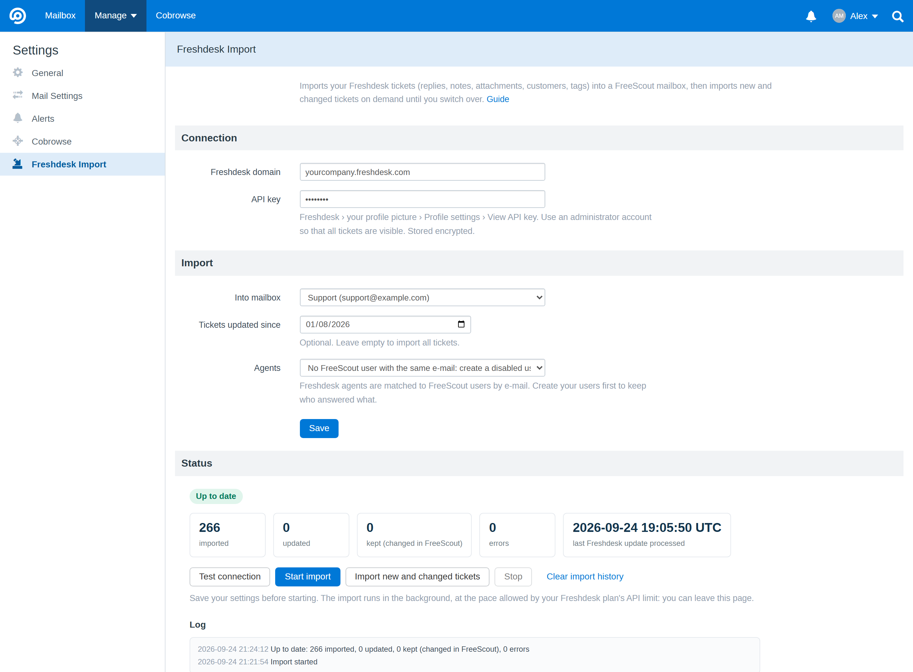

# Freshdesk Import for FreeScout

Move from [Freshdesk](https://freshdesk.com) to [FreeScout](https://freescout.net) without losing your history. This
module imports your Freshdesk tickets into a FreeScout mailbox, from FreeScout's own settings page, then keeps importing
new and changed tickets on demand until the day you switch over.

- **Everything in a ticket**: customer messages, agent replies, private notes, attachments, original dates, status,
  assignee, the Cc Freshdesk pre-fills when replying, priority, type, custom fields (kept in the conversation data) and
  tags (in the [Tags module](https://freescout.net/module/tags/) when it is active).
- **Inline images are copied into FreeScout.** Images pasted in Freshdesk messages point to Freshdesk URLs that expire;
  the importer downloads them and rewrites the messages, so they still show once Freshdesk is closed.
- **Tickets created by agents** (outbound e-mails) keep their first message credited to the agent.
- **Customers** are created or matched by e-mail, with their phone and mobile numbers.
- **Agents** are matched to FreeScout users by e-mail; agents without a user get a disabled placeholder user named
  after them (or tickets stay unassigned, your choice).
- **Runs in the background**, in small batches started by the FreeScout scheduler: no timeout, resumes by itself after a
  server restart, and pauses automatically when Freshdesk's API rate limit is reached.
- **Sync until you switch over**: "Import new and changed tickets" continues where the last run stopped. A ticket
  changed in Freshdesk is re-imported, **unless** it has been replied to or noted in FreeScout in the meantime: it is
  then left untouched and reported in the log, so work done in FreeScout is never overwritten.
- Live status, counters and log on the settings page. English and French.

## Requirements

- FreeScout 1.8 or newer, with its [cron job](https://github.com/freescout-help-desk/freescout/wiki/Installation-Guide#9-configuring-cron-jobs)
  set up (`php artisan schedule:run` every minute): the import runs from it.
- A Freshdesk API key, preferably an **administrator's** (see below).

## Installation

1. Download the latest release and unzip it into the `Modules` folder of FreeScout: you get `Modules/FreshdeskImport`
   (the folder **must** have this name).
2. In FreeScout, **Manage › Modules**: activate **Freshdesk Import**.
3. **Manage › Settings › Freshdesk Import**: fill in the settings, save, then click **Start import**.

## Settings

| Setting | |
|---|---|
| **Freshdesk domain** | `yourcompany.freshdesk.com` (or just `yourcompany`). |
| **API key** | Freshdesk › your profile picture › Profile settings › *View API key*. Stored encrypted. |
| **Into mailbox** | The FreeScout mailbox that receives the tickets. |
| **Tickets updated since** | Optional: only import tickets updated since this date. Empty = everything. |
| **Agents** | What to do with a Freshdesk agent who has no FreeScout user with the same e-mail: create a disabled user named after them (keeps who answered what), or leave their tickets unassigned. |

**Use an administrator's API key.** With the key of an agent who is not an administrator, Freshdesk still gives access
to the tickets but not to the list of agents: tickets are then imported unassigned and replies are credited to the
FreeScout user who started the import (the log says so).

**Create your FreeScout users first**, with the same e-mail addresses as in Freshdesk, to keep assignments and authors.

## Switching over

1. Run **Start import** once. Speed depends on your Freshdesk plan's API limit (one or two API calls per ticket, plus attachments):
   you can leave the page, it runs in the background.
2. Until the switch, click **Import new and changed tickets** whenever you want to catch up.
3. On switch day: point your support address to FreeScout, run **Import new and changed tickets** a last time, and
   check the log for tickets "changed in both tools".

## Notes

- Freshdesk statuses: *Open* → Active, *Pending* and custom statuses → Pending, *Resolved* / *Closed* → Closed, spam →
  Spam.
- Conversations get FreeScout numbers; the Freshdesk ticket number is kept in the conversation data (`fd_id`).
- **Clear import history** forgets which tickets were imported (not the conversations themselves): a new import would
  then create them again.
- Not imported (yet): companies, canned responses, knowledge base, satisfaction ratings, time entries.

## License

[AGPL-3.0](LICENSE), like FreeScout.

Freshdesk is a trademark of Freshworks Inc. This module is an independent tool, not affiliated with or endorsed by
Freshworks.
